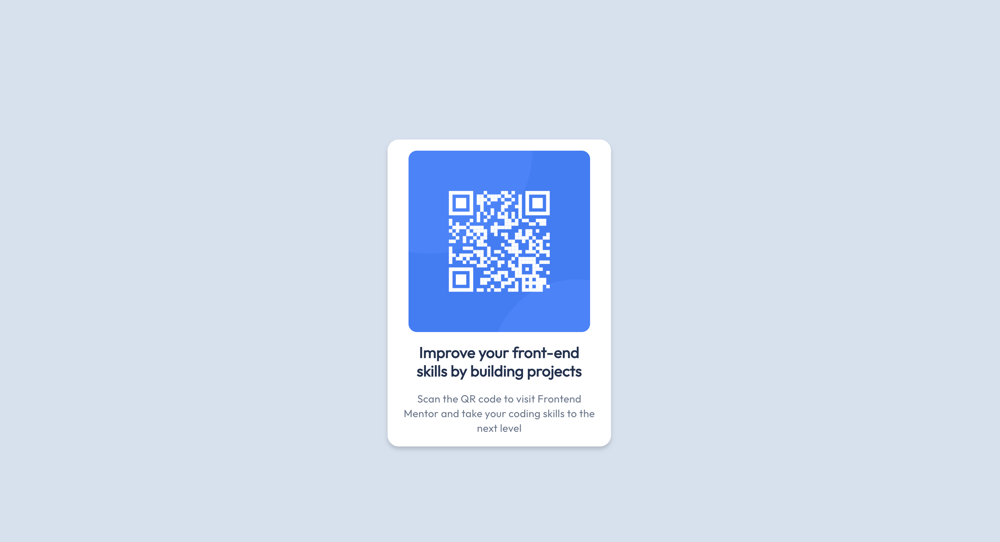
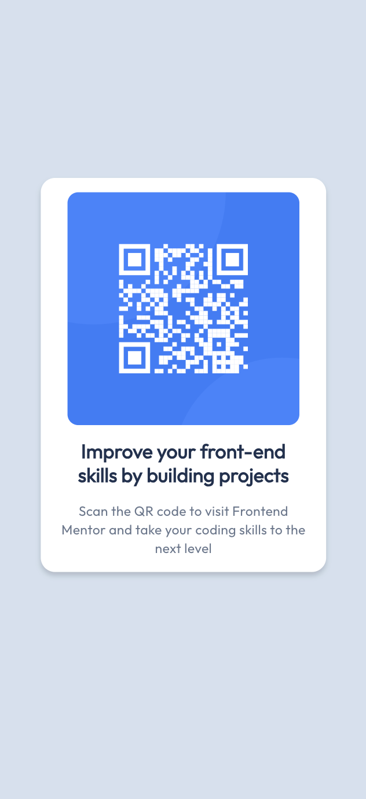

# Frontend Mentor - QR code component solution

This is a solution to the [QR code component challenge on Frontend Mentor](https://www.frontendmentor.io/challenges/qr-code-component-iux_sIO_H). Frontend Mentor challenges help you improve your coding skills by building realistic projects. 

## Table of contents

- [Overview](#overview)
  - [Screenshot](#screenshot)
  - [Links](#links)
- [My process](#my-process)
  - [Built with](#built-with)
  - [What I learned](#what-i-learned)
  - [Continued development](#continued-development)
  - [Useful resources](#useful-resources)
- [Author](#author)
- [Acknowledgments](#acknowledgments)


## Overview

This is a Frontend Mentor challenge where I am required to build a mobile responsive QR code using html and css fundamentals. 

### Screenshot

Desktop: 
Mobile: 


### Links

- Solution URL: [Kabbs GitHub Page](https://kabbs19.github.io/qr-code-development-main/)

## My process

Firstly, cloned the repo into my GitHub account to track and commit changes. I then started by using html elements to create the layout of my index.html file. Once I was happy with the layout, I worked on the stylesheet by firstly adding the necessary styles provided by the design figma file and then additional styles and classes needed to create the look of the design.

I struggled with mobile design as this is a concept I am still learning. Once I was happy with all of the work, I published my solution using GitHub Pages

### Built with

- HTML5 markup
- CSS custom properties
- Flexbox

### What I learned

I learnt how to import a Figma file, publish on GitHub pages and how to better center my elements for desktop and mobile specifically using the max-width attribute.

```css
.qr-code-container {
    display: flex;
    flex-flow: column wrap;
    align-items: center;
    text-align: center;
    max-width: 320px;
    margin: 200px auto;
    background-color: var(--white);

}
```

### Continued development

I need to continue my learning of mobile responsiveness and flexbox.

### Useful resources

- no new resources

## Author

- Frontend Mentor - [@Kabbs19](https://www.frontendmentor.io/profile/Kabbs19)

## Acknowledgments

None
